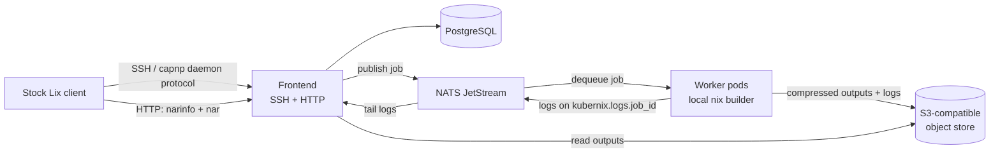
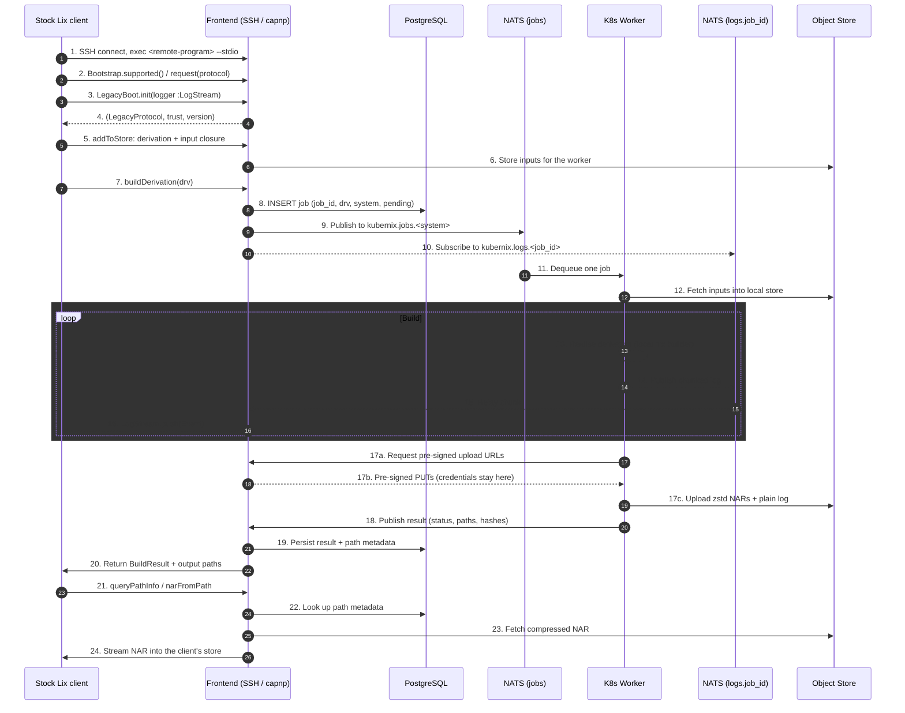

# Kubernix Architecture & Design

## Overview

Kubernix is a distributed remote builder for [Lix](https://lix.systems). It presents itself to a
Lix client as an ordinary remote store, reached over SSH exactly as `ssh-ng://` is — but instead
of building locally it fans work out to a pool of workers running on Kubernetes.

The client connects over **SSH** to the Kubernix **frontend**, which implements the Lix
client↔daemon protocol as **Cap'n Proto RPC**. Each build request becomes a **job**
with a **job ID**: the job is persisted in **PostgreSQL** and queued on **NATS JetStream**.
A worker dequeues exactly one job, runs it against its **local Nix builder**, and streams the
build log back over a second NATS subject keyed by that same job ID, which the frontend relays
to the waiting client. Derivation outputs and their logs are compressed and written to an
**S3-compatible object store**. The frontend additionally exposes an **HTTP binary-cache
endpoint** serving `narinfo` and NAR files for built outputs, so any client can substitute
results the same way it would from any Nix cache.

Client configuration:

```
# load the kubernix store plugin
plugin-files = /nix/store/…-kubernix-plugin/lib/lix/plugins/kubernix.so

# as a remote builder
builders = kubernix://kubernix@builder.example.org x86_64-linux,aarch64-linux

# and, optionally, as a substituter for outputs others have already built
substituters = https://builder.example.org
trusted-public-keys = builder.example.org:<base64 key>
```

> **Why a plugin, and why not `ssh-ng://`.**
> `ssh-ng://` does not speak Cap'n Proto. `SSHStore::init` (`lix/libstore/ssh-store.cc:151`)
> calls `RemoteStore::initConnection` (`lix/libstore/remote-store.cc:52`), which performs the
> *legacy* worker-protocol handshake. The RPC implementation is
> `class RpcRemoteStore : public UDSRemoteStore` (`lix/libstore/uds-remote-store.hh:141`) —
> reachable only over unix sockets.
>
> Rather than fork Lix, Kubernix ships a plugin registering its own `kubernix://` scheme that
> drives the SSH transport and the RPC bootstrap itself. It cannot claim `ssh-ng://`, which Lix
> already registers. See [The client plugin](#the-client-plugin).



---

## Components

### 1. Frontend (Control Plane)

A Rust service exposing two network surfaces. It is the only component clients ever talk to.

**SSH surface (`russh`)** — the request path:

- Terminate SSH connections and authenticate clients by public key.
- Honour the native `ssh-ng://` flow: the client opens a session channel and `exec`s
  `<remote-program> --stdio`. The frontend does not spawn that binary — it recognises the request
  and serves the daemon protocol itself on the channel's byte stream. Because `remote-program` is
  a client-side setting, match on the `--stdio` suffix rather than the binary name.
- Serve the Cap'n Proto RPC daemon protocol (see [Wire Protocol](#wire-protocol)), implementing
  the operations a remote builder must answer: `queryValidPaths`, `isValidPath`, `queryPathInfo`,
  `addToStore`, `addToStoreNar`, `buildDerivation`, `buildPaths`, `narFromPath`, `setOptions`.
- Accept the derivation and its closure of inputs from the client, storing them in the object
  store so workers can fetch them.
- Allocate a **job ID** (UUID v4) per build request, insert the job row into PostgreSQL, and
  publish the job onto the JetStream work queue.
- Subscribe to `kubernix.logs.<job_id>` and push each chunk into the client's `LogStream`
  capability, so it renders in the client's terminal exactly like a local build.
- Await the job's terminal state and return the build result and output paths.
- Serve the built outputs back to the requesting client on the same connection
  (`queryPathInfo` / `narFromPath`), reading them from the object store.

**HTTP surface (`axum`)** — the substitution path:

- Serve `/nix-cache-info`.
- Serve `/<store-path-hash>.narinfo` for derivation outputs, generated from the metadata
  PostgreSQL holds for that path and signed with the cache's private key.
- Serve `/nar/<...>` — the compressed NAR, either proxied from the object store or answered
  with a redirect to a pre-signed URL.
- Serve `/log/<drv-path-hash>` — the archived build log, so `nix log` works after the fact.

The frontend therefore hands out path contents two ways, from the same Postgres metadata and the
same S3 objects: over the daemon protocol to the client that requested the build (which copies
outputs back automatically, as it would from any remote builder), and over HTTP to anyone who
configures Kubernix as a substituter.

Persisting job state in PostgreSQL is what lets a disconnected client reconnect and still
retrieve its result: the job outcome does not live only in the client's SSH session.

### 2. Worker (Kubernetes Job Runner)

A warm, dynamically scalable pool of pods, each with a local Nix builder. Keeping the pool warm
avoids pod-startup latency, so sub-second derivations execute effectively instantly.

- **Responsibilities:**
  - Dequeue **exactly one** job at a time from the work queue, filtered by the system it can build
    (`x86_64-linux`, `aarch64-linux`, …).
  - Fetch the derivation's required inputs from the object store into its local store.
  - Realise the derivation against the local Nix builder.
  - Stream build output, chunked, to `kubernix.logs.<job_id>` as it is produced.
  - Upload the outputs (zstd-compressed NARs) and the build log to the object store, using
    **pre-signed URLs obtained from the frontend** — the worker never holds S3 credentials.
  - Publish the terminal result — status, output paths, and their hashes — to the results stream,
    *after* the artifacts are uploaded.

A worker holds the job's JetStream message un-acked for the duration of the build, so a worker
that dies mid-build causes the job to be redelivered rather than silently lost.

---

## Wire Protocol

The SSH surface speaks the Lix daemon protocol as defined in `lix/libstore/daemon.capnp`. This is
**Cap'n Proto RPC** — capabilities, promise pipelining and streaming — not merely Cap'n Proto used
as a serialization format. The frontend is an RPC *server* over the SSH channel's byte stream.

The schemas involved are `daemon.capnp`, `logging.capnp`, `libutil/types.capnp` and
`libstore/types.capnp`. They are vendored into `protocol/vendor/lix/…` preserving directory
structure, because they use absolute imports (`/lix/libutil/types.capnp`).

> `daemon.capnp` carries an explicit notice: *"these definitions are EXPERIMENTAL and come with
> NO stability guarantees"*. The vendored copies are pinned to the Lix revision in `flake.lock`
> and re-vendored deliberately.

### Bootstrap sequence

Driven by the client in `RpcRemoteStore::prepareRpcConnection`
(`lix/libstore/uds-remote-store.cc:246-295`):

1. `capnp::TwoPartyClient` bootstrap → cast to `Bootstrap`
2. `supported()` → `List(ProtocolDescription)`
3. `request(clientInfo, protocol)` → `Protocol`, cast to `LegacyBoot`
4. `init(logger :LogStream)` → `(protocol :LegacyProtocol, trust :Trust, version :Text)`
5. all store operations issued on the `LegacyProtocol` capability

Step 4 is the important one architecturally: **the client hands the server a logger capability.**
That capability is the sink for streamed build logs — the frontend pushes `Event`s from
`kubernix.logs.<job_id>` straight into it. It is what makes a remote build's output appear in the
user's terminal indistinguishably from a local one, and it is why logs need no side channel.

The `Trust` value returned in step 4 tells the client whether it may ask the frontend to do
privileged things; Kubernix reports `unknown` unless the authenticated key is configured as
trusted.

### Protocol identifier

The id is version-pinned (`lix/libstore/daemon.cc:43`):

```cpp
const std::string UNSTABLE_LEGACY_TUNNELED = "lix/legacy/" PACKAGE_VERSION;   // e.g. lix/legacy/2.96.0-dev
```

The client's check contains a quirk (`uds-remote-store.cc:259-263`):

```cpp
if (supportedProtos.size() != 1 && supportedProtos[0].getId() != UNSTABLE_LEGACY_TUNNELED)
    co_return false;
```

That is `&&`, not `||` — advertising **exactly one** protocol short-circuits the id comparison
entirely. The frontend therefore advertises a single entry and is lenient about the id requested
in step 3, which makes it version-agnostic. This is almost certainly an upstream bug that will
become `||`, so the advertised id is configurable rather than hardcoded.

### Error encoding

Errors cross the wire as kj exceptions of type `FAILED` with source `"remote"`, whose description
embeds a serialized error (`lix/libutil/types-rpc.cc:17`, `encodeLossy`):

```
"<message, or '(oversize message)' if >128 chars> " + header + base64(packed capnp Error) + trailer
```

`header` and `trailer` are the `v1Errors` constants in `lix/libutil/types.capnp`. Note the payload
is **packed** Cap'n Proto encoding (`capnp::writePackedMessage`), then base64 — plain framing will
not decode.

### The client plugin

Kubernix ships a Lix plugin (`plugin/`) registering a `kubernix://` store scheme. It is a
*transport* component only — it does not intercept builds or reimplement any build logic, and the
frontend remains a plain daemon-protocol server.

The plugin:

1. Takes `host`, `port`, `ssh-key`, `compress` and `remote-program` from a config type inheriting
   `RemoteStoreConfig` + `CommonSSHStoreConfig` — the same settings `ssh-ng://` exposes.
2. Runs `nix::SSH::startCommand("<remote-program> --stdio")` (`lix/libstore/ssh.hh`) to get a
   bidirectional socket fd.
3. Wraps that fd in a `capnp::TwoPartyClient` and performs the bootstrap sequence above, passing
   an `rpc::log::RpcLoggerServer` (from the installed `lix/libutil/logging-rpc.hh`) as the
   `LogStream`.
4. Implements the store interface by delegating to the returned `LegacyProtocol` capability.

`RpcRemoteStore` cannot be reused for step 4: `init(AutoCloseFD)`, `prepareRpcConnection()` and
the `rpc` state are all `private` and the constructor is `Badge`-gated
(`uds-remote-store.hh:244-265`), so the plugin mirrors that delegation layer itself.

**Costs, accepted deliberately.** The plugin compiles against unstable Lix C++ internals and must
be rebuilt per Lix release — `nix/nixpkgs.nix` pins Lix via `flake.lock`, which bounds the blast
radius. It duplicates delegation code that already exists upstream. And client config is not
stock: it needs `plugin-files` and the `kubernix://` URI.

**Nothing is upstreamed for now.** Two changes would eventually simplify this a lot — making those
`RpcRemoteStore` members `protected`, and routing `ssh-ng://` through the RPC bootstrap — but they
are deferred, and the plugin is the supported path in the meantime.

> **Packaging bug to work around.** `daemon-rpc.hh` is installed, but its line 7 includes
> `lix/libstore/daemon.capnp.h`, which is **not** — `lix/libstore/meson.build:22-38` omits
> `install : true` on the capnp `custom_target`, unlike libutil's equivalent. So that header is
> uncompilable out-of-tree as shipped. See [PLAN.md](PLAN.md) Phase 1 for the options; the
> leading one is a one-line packaging patch applied via overlay, which is not a protocol fork.

---

## Infrastructure

### NATS JetStream

The asynchronous backbone, chosen for handling variable-length jobs without strict consumer
timeouts. Three streams, each with a distinct delivery guarantee:

| Stream | Subjects | Type | Purpose |
| --- | --- | --- | --- |
| `kubernix_jobs` | `kubernix.jobs.<system>` | WorkQueue | Dispatch a build to exactly one worker; the system suffix lets workers filter for the platform they can build. |
| `kubernix_logs` | `kubernix.logs.<job_id>` | Pub/Sub | Live build output, partitioned by job ID so a frontend tails only the builds its clients are watching. Ephemeral — the durable copy is the compressed log in the object store. |
| `kubernix_results` | `kubernix.results.<job_id>` | Stream | Terminal job outcome: status, output paths, hashes. Durable, so a result is not lost if the frontend restarts. |

### PostgreSQL

The system of record for job state and for the path metadata the narinfo endpoint is generated
from. Broadly:

- `jobs` — job ID, derivation path, system, status, timestamps, output paths.
- `store_paths` — one row per output path: store path, NAR hash and size, file (compressed) hash
  and size, compression algorithm, references, deriver, and the object-store key of the NAR.
  This is exactly the data a `narinfo` response is made of, and it is also what the daemon
  protocol's `queryPathInfo` answers from.
- `build_logs` — job ID → object-store key of the archived log.

### S3-Compatible Object Store

Holds everything durable and large:

- Derivation **inputs** uploaded by the frontend, so workers can fetch what the client had locally.
- Derivation **outputs**, as zstd-compressed NARs, stored exactly as the HTTP cache serves them so
  no repacking is needed at read time.
- Build **logs**, treated as outputs and uploaded the same way, but **uncompressed** — `nix log`
  wants plain text, and logs are small next to outputs. See [PLAN.md](PLAN.md) Phase 6b.

Objects are content-addressed by NAR hash where possible, so identical outputs from repeated
builds deduplicate.

**Credentials live only on the frontend.** Workers upload via time-limited pre-signed URLs the
frontend issues per object, so a worker holds a narrow expiring capability rather than a
credential — and build outputs still go straight to the object store instead of through the
frontend.

### Kubernetes

Hosts the worker pool, scaled dynamically (e.g. via KEDA) on the depth of the NATS job queue.

---

## Job Lifecycle

The job ID is the join key across every component: it names the DB row, the log subject, the
result subject, and the log object in the store.



Step 16 pushes into the `LogStream` capability the client supplied back in step 3 — the frontend
holds it for the life of the connection.

Step 18 travels over the `kubernix_results` stream, not directly worker→frontend; it is drawn
collapsed for readability.

A client that instead has Kubernix configured as a **substituter** skips steps 21–24 and takes
the HTTP path: `GET /<hash>.narinfo` → signed narinfo generated from `store_paths` → `GET /nar/…`
→ compressed NAR from the object store. Same metadata, same objects, different transport.

---

## Design Notes

**Why the store abstraction rather than intercepting builds.** The original design intercepted the
build flow from a plugin that registered a remote-builder abstraction, polling an HTTP endpoint for
completion. That is abandoned. The `ssh-ng://` shape is better: the client opens an SSH session,
execs `<remote-program> --stdio`, and speaks the daemon protocol. A frontend implementing that
protocol faithfully is usable as a builder or a store, and owes the client nothing beyond correct
protocol behaviour.

There is still a plugin, but it is a much smaller thing than before — a transport shim that opens
the SSH connection and runs the RPC bootstrap. It contains no build logic, no polling and no job
model; the frontend stays a plain daemon-protocol server. Version-matching C++ against Lix
internals remains the largest adoption cost in the system, which is why the plugin is kept as thin
as it can be.

**Why Cap'n Proto rather than the legacy worker protocol.** Both are viable and the legacy one
works with stock clients today. The RPC protocol is where Lix is heading, and its capability model
gives us the `LogStream` handoff for free — log relay becomes an object the client owns rather
than an opcode stream we have to interleave correctly with responses. The cost is that the schema
is explicitly unstable and the client-side gap above has to be closed.

**Why SSH rather than plain HTTP for the request path.** That choice follows from the above — the
daemon protocol is a stateful, bidirectional conversation, and the native flow carries it over
SSH. SSH also supplies authentication, encryption, and multiplexing for free, and clients already
have keys and a mental model for trusting a builder host.

**Why the log stream is separate from the result stream.** Logs are high-volume, lossy-tolerable,
and only interesting while someone is watching; results are low-volume and must not be lost.
Splitting them lets logs be ephemeral pub/sub while results get durable delivery, and lets a
frontend tail exactly the jobs its connected clients care about.

**Why results are persisted before being returned.** A client that disconnects mid-build can
reconnect and query the job; the SSH session is not the only copy of the outcome.

**Why outputs are also served over HTTP.** The requesting client gets its outputs over the daemon
connection, as it would from any remote builder. But once a build completes, its outputs are
ordinary cache content — exposing them as a standard binary cache lets clients that never
requested the build substitute them, and lets a client fetch a previously-built path without
opening a build session at all.

**Signing.** The frontend signs narinfo responses with the cache's private key; clients configure
the matching public key as a trusted substituter key. Without this, clients would refuse to
substitute the outputs they just paid to have built.
